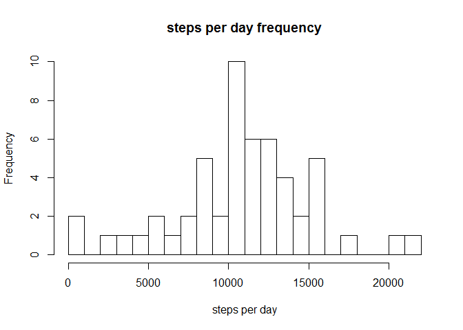
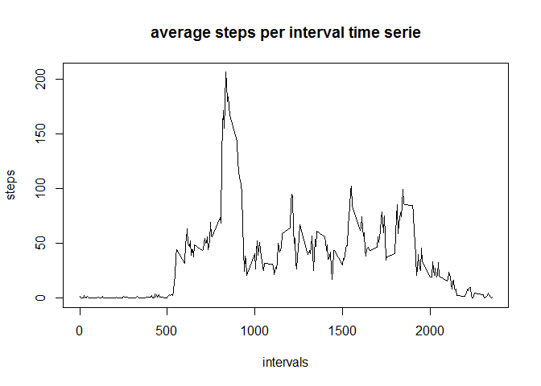
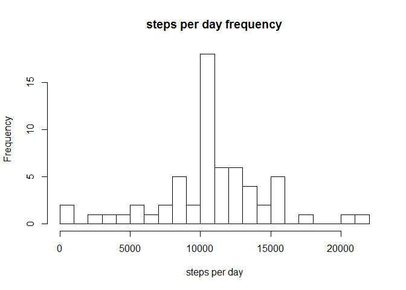
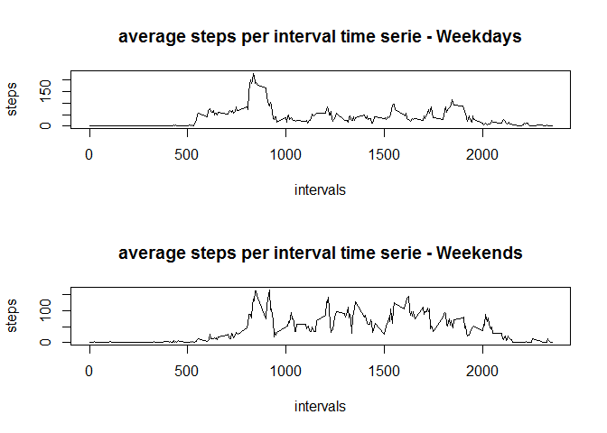

# Reproducible Research: Peer Assessment 1


## Loading and preprocessing the data


```r
url_data_zip="http://d396qusza40orc.cloudfront.net/repdata%2Fdata%2Factivity.zip"
temp <- tempfile()
download.file(url_data_zip,temp)

rawdata <- read.csv(unz(temp, "activity.csv"))

unlink(temp)
```

##What is mean total number of steps taken per day?

1. histogram of the total number of steps taken each day


```r
steps_per_date <- tapply(rawdata$steps,rawdata$date,sum)
hist(steps_per_date, breaks=30,xlab="steps per day",main="steps per day frequency")
```

 

2. mean and median total number of steps taken per day


```r
mean(steps_per_date,na.rm=TRUE)
```

```
## [1] 10766
```

```r
median(steps_per_date,na.rm=TRUE)
```

```
## [1] 10765
```

##What is the average daily activity pattern?

1. time series plot of the 5-minute interval (x-axis) and the average number of steps taken, averaged across all days (y-axis)


```r
steps_per_dayinterval <- tapply(rawdata$steps,rawdata$interval,mean,na.rm=TRUE)
plot(names(steps_per_dayinterval),steps_per_dayinterval,type="l",xlab="intervals",ylab="steps",main="average steps per interval time serie")
```

 

2.
5-minute interval on average across all the days in the dataset which contains the maximum number of steps

```r
names(which.max(steps_per_dayinterval))
```

```
## [1] "835"
```

##Imputing missing values

1. total number of missing values in the dataset

```r
sum(is.na(rawdata$steps))
```

```
## [1] 2304
```

2. Filling all missing values with the mean for that 5-minute interval

```r
df_steps_per_dayinterval <- data.frame(steps_per_dayinterval)
new_data <-merge(rawdata, df_steps_per_dayinterval, by.x="interval", by.y="row.names")
new_data$steps[is.na(new_data$steps)] <- new_data$steps_per_dayinterval[is.na(new_data$steps)]
new_data$steps_per_dayinterval <- NULL
```

3. histogram of the total number of steps taken each day - with missing values imputed

```r
new_steps_per_date <- tapply(new_data$steps,new_data$date,sum)
hist(new_steps_per_date, breaks=30,xlab="steps per day",main="steps per day frequency")
```

 

4. mean and median total number of steps taken per day - with missing values imputed

```r
mean(new_steps_per_date)
```

```
## [1] 10766
```

```r
median(new_steps_per_date)
```

```
## [1] 10766
```

5. Do these values differ from the estimates from the first part of the assignment? What is the impact of imputing missing data on the estimates of the total daily number of steps?

>> The mean and median are almost inchanged
>> We can see graphically that imputing missing data has amplified the fact that the majority of the average steps per day number is in the histogram bar just up to 10000 steps
However, the values seem globally the same.

##Are there differences in activity patterns between weekdays and weekends?

```r
new_data$day <- weekdays(as.Date(new_data$date))
new_data$weekpart <- "weekday"
new_data$weekpart[new_data$day %in% c("samedi","dimanche")] <- "weekend"

new_data_weekday<-new_data[new_data$weekpart=="weekday",]
new_data_weekend<-new_data[new_data$weekpart=="weekend",]

par(mfrow=c(2,1))
new_weekday_steps_per_dayinterval <- tapply(new_data_weekday$steps,new_data_weekday$interval,mean)
plot(names(new_weekday_steps_per_dayinterval),new_weekday_steps_per_dayinterval,type="l",xlab="intervals",ylab="steps",main="average steps per interval time serie - Weekdays")
new_weekend_steps_per_dayinterval <- tapply(new_data_weekend$steps,new_data_weekend$interval,mean)
plot(names(new_weekend_steps_per_dayinterval),new_weekend_steps_per_dayinterval,type="l",xlab="intervals",ylab="steps",main="average steps per interval time serie - Weekends")
```

 
